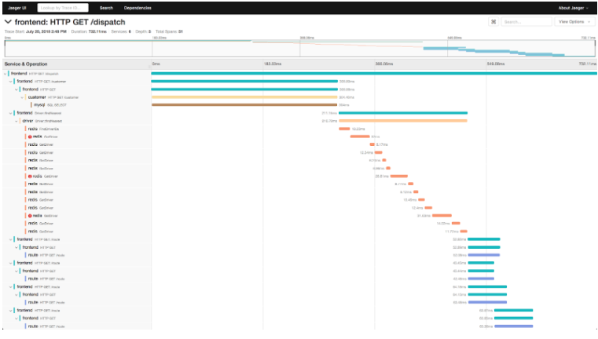
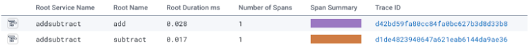
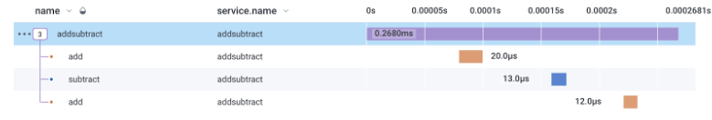

# Tracing Basics in Python

Tracing is an observability technology that provides insight into the execution of a program. To get the full benefit of tracing one needs to instrument the code of the program. This means that the coder has to include statements in the program that help with tracing, for example establishing the names of the traced section and adding session ids and other pertinent information, for example, values of key variables (username, browser type, geography, etc)

Trace information generated by the instrumented program is sent to a tracing server and can there be analyzed by looking at execution speed and anomalies. Often one starts with the call graph that breaks down what functions were called for the execution of the program, how long each took, and how they were nested.
  

We will start with a simple program in python, add instrumentation to it, take a look at the generated data structures, export them to a visualization program, debug an issue, address the issue, and increment the amount of data collected in the traces to gain better insight for debugging.

We will use an open-source toolkit called Open Telemetry for the instrumentation and use Honeycomb.io for the visualization part.

There are several other technologies that you might hear about when looking into tracing, Jaeger, Zipkin, and other commercial players such as Lightstep. The big monitoring providers are also getting into the game: Datadog, Dynatrace, New Relic, and others. Be aware that Tracing is a new space and not everybody offers the same functionality.

Here is our initial python3 program that we will work off. It adds and subtracts numbers, but rather than saying 2+3 we will define functions for addition and subtraction:  

a.py:

    def add(a,b):
        return a+b
    def subtract(a,b):
       return a-b

    # main
    s = add(1,2)
    s = subtract(s,4)
    s = add(s,5)
    print(s)

To run this program with telemetry we need to:
-   Import the right modules
-   Initialize a tracer
-   Create trace spans for each function
-   A span is a trace unit with a name. It starts the timing for a trace step and ends it when the unit is done. Here we want each function to be a span.
    
aa.py:

    from opentelemetry import trace
    from opentelemetry.sdk.trace import TracerProvider
    from opentelemetry.sdk.trace.export import BatchSpanProcessor
    from opentelemetry.exporter.otlp.proto.http.trace_exporter import OTLPSpanExporter

    # Initialize tracing and an exporter that can send data to Honeycomb
    provider = TracerProvider()
    processor = BatchSpanProcessor(OTLPSpanExporter())
    provider.add_span_processor(processor)
    trace.set_tracer_provider(provider)
    tracer = trace.get_tracer("addsubtract")

  
    @tracer.start_as_current_span("add")
    def add(a,b):
        return a+b

    @tracer.start_as_current_span("subtract")
    def subtract(a,b):
        return a-b

 
    # main
    s = add(1,2)
    s = subtract(s,4)
    s = add(s,5)
    print(s)

The relevant python modules to install are:
-   opentelemetry-distro
-   opentelemtry-sdk-tools

Run the program with opentelemetry-instrument –tracer_exporter console –metrics_exporter console python3 aa.py. You will see output from the trace in JSON format. Running it like this:

    ​​opentelemetry-instrument --traces_exporter console --metrics_exporter console python3 aa.py | egrep '"name|_time'
will give a more intuitive output.

    "name": "add",
    "start_time": "2023-03-18T11:44:39.834039Z",
    "end_time": "2023-03-18T11:44:39.834064Z",
    "name": "subtract",
    "start_time": "2023-03-18T11:44:39.834114Z",
    "end_time": "2023-03-18T11:44:39.834125Z",

…

Now let’s try a server to visualize the traces. We will use honeycomb.io’s product. It has a free tier that is generous enough for our usage. Open an account and get the necessary keys.

Then set the environment, so that opentelemetry will know where to send the data.

    export OTEL_EXPORTER_OTLP_ENDPOINT="https://api.honeycomb.io/"
    export OTEL_EXPORTER_OTLP_HEADERS="x-honeycomb-team=s9ss7f5j5kxtwkypttop4Ugss7tfNYjkjm3P4A"
    export OTEL_SERVICE_NAME="addsubtract"

The key above does not work- you need to replace it with your own.

Run the program with python3 aa.py

You should be able to see the trace in the honeycomb.io web console. Make sure you are in the right environment, then New Query, select the pre-defined query with the slowest trace, select last 10 minutes, select your dataset (addsubtract) and Run Query. Click on traces - you should see a trace for addsubtract, but there are three, two for add and one for subtract. Why are they not joined together?
  

Answer - there is no span that encompasses the 3 calls, they are each their own independent span. The easiest way to fix this is to define a main function with its own decorator and then call that main function:

  
    # main
    @tracer.start_as_current_span("addsubtract")
    def main():
        s = add(1,2)
        s = subtract(s,4)
        s = add(s,5)
        print(s)
        
    main()

Run again - now we see one trace as expected. You might see more, remember you are querying the last 10 minutes, so if you were very fast the past traces are still within range of the query.

This is pretty cool, but how would this work in a distributed system where these calls go to different microservices?

Stand by for part II.

Helpful LInks:

-   [https://lightstep.com/blog/opentelemetry-for-python-the-hard-way](https://lightstep.com/blog/opentelemetry-for-python-the-hard-way)    
-   [https://lightstep.com/blog/opentelemetry-context-propagation](https://lightstep.com/blog/opentelemetry-context-propagation)
-   [https://opentelemetry.io/docs/instrumentation/python/manual/](https://opentelemetry.io/docs/instrumentation/python/manual/)
-   [https://opentelemetry.io/docs/reference/specification/trace/api/](https://opentelemetry.io/docs/reference/specification/trace/api/)
-   [https://github.com/open-telemetry/opentelemetry-python/discussions/1919](https://github.com/open-telemetry/opentelemetry-python/discussions/1919)
-   [https://opentelemetry.io/docs/instrumentation/python/cookbook/](https://opentelemetry.io/docs/instrumentation/python/cookbook/)
