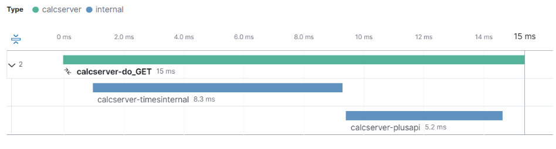
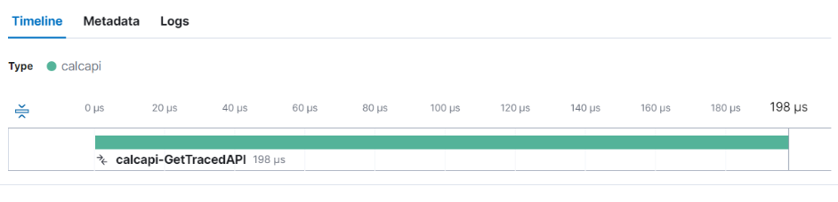
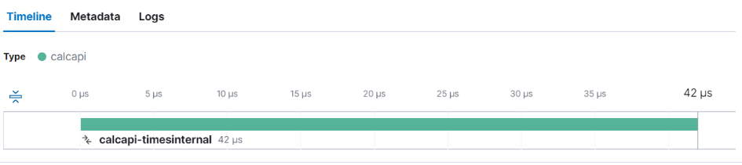
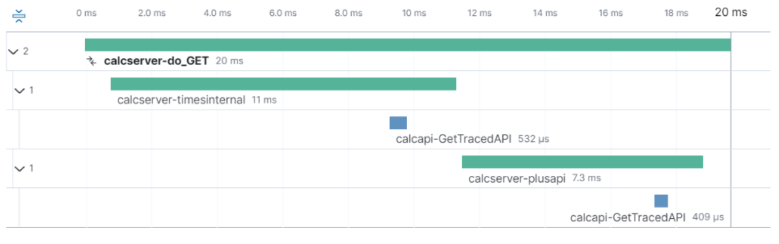

Tracing Part II

We will use a demo application for a calculator service (calc.py) to see how distributed tracing works. It is a simple to understand application (python3 calc.py) that responds to API requests in the format /api?2+3-1*4 * (4+5). 

Calc.py requires the Pip module ply.

    curl http://127.0.0.1:8080/api?2+3*6
    {"operation":"2+3*6","result":"20"}

The distributed version has two parts:

- a server module (calcserver.py) that receives and breaks down the calculation to its parts, for example 3+2 * 3 gets broken down to:  2 * 3 result 6 and then 3+6 result 9.
- an api module (calcapi.py) that performs the basic operations: +,-,*,/

The server module uses HTTP calls to communicate to the api module, the API returns a JSON formatted result, just like the monolith calc.py

We manually instrument both server and api modules with OpenTelemetry and get the following trace results:

And

And

All tarcing in now separate, we lost the visibility of embedding of spans across services.

The solution is to add a specially formatted “traceparent” header in the call to the API. The data for the header comes from the span’s context. In our code the span is called “child”, accessing field 0 (trace_id) and 1 (span_id) and formatting it the correct way with version number (00-) and traceflags (here set to -01) establishes the call chain.

    tp = "00-"+str(hex(child.context[0]))[2:]+"-"+str(hex(child.context[1]))[2:]+"-01"
    response = requests.get(url,headers = {"traceparent":tp})

The format is based on a W3c standard that defines how to enable distributed tracing - https://www.w3.org/TR/trace-context/#version-format.

Running calcserver2.py gives the following results.

This is all quite manual, is there a way to automate it? Let look for a easier way in [part III](readme3.md)
